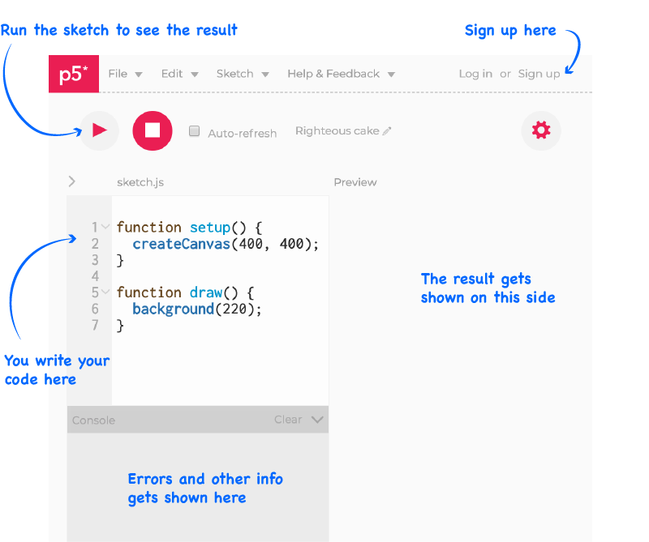

  The aim of this tutorial is to get you familiar with the p5js library.
  You will also write your first programming 'sketch' with p5js.

## P5js helps you do creative coding in JavaScript

P5js is a JavaScript library for creative coding.

<!-- Idea for a 'what is' introductory interactive -->

## Watch the hello p5js video

This short [interactive video](http://hello.p5js.org/) gives an introduction
to the p5 project from Lauren McCarthy and Daniel Shiffman. Notice how the
graphics in the video are interactive? That's all done with the p5 library.
Make sure you click around and explore how it works!

<!-- TODO: I'd like to embed the hello p5js video but it requires an extra click.

<iframe src="http://hello.p5js.org/" height="315" width="560" 
  allowfullscreen="" frameborder="0">

-->

## Sign up for an account on the p5js web editor

The video below gives a quick introduction to the p5js web editor. It shows how
to sign up for an account, some of the settings, the parts of the interface,
how to run your sketches, and how to get a link that you can share with others.



  <strong>Try it now:</strong> Go to the online editor at 
  <a href="https://editor.p5js.org">https://editor.p5js.org</a>,
  sign up for an account, explore how the editor works and save your first
  sketch

Once you are signed in, the editor should look something like the following
picture (depending on what theme you've chosen).

When you first open the editor, it will have some default code already filled
in. If you press the `play` button, you will see what this default code does.
You should see a grey square appear to the right of the code. This is the
`canvas`, where p5js does most of its drawing. Try it now.

We will go into more detail about what the different parts of the code do later.
First, let's add something a bit more interesting.

* Update the code by adding `ellipse(200, 200, 100);` on line 7, so it looks
  like the following:


function setup() {
  createCanvas(400, 400);
}

function draw() {
  background(220);
  ellipse(200, 200, 100);
}


## Explaining the parts of the code

First, see if you can identify the two blocks of the code that define the
`setup` and `draw` functions. These special functions are the 'skeleton' of a
p5js program and pretty-much every p5js sketch you write will have them.

The `setup` function runs once when the page first loads. It's where you do
can create the canvas that p5.js will draw onto, set text formatting,
and set the colours used for drawing shapes.

The `draw` function runs over and over again as long as the sketch is running.
It controls how the sketch should evolve over time, including
animations and other dynamic elements of the sketch.

## Your first p5js sketch: the world's simplest drawing program

<!-- P5js is a JavaScript library that makes it easy to make creative coding programs
that run in the browser. P5js provides a whole range of useful functions for 
loading data, creating sound, responding to user input, interacting
with the HTML pages, drawing, and more.  -->

To begin with, we are going to look at the drawing functions that p5js provides.

Change the code in the editor so that it reads as follows:


function setup(){
  createCanvas(100, 100);
}

function draw(){
  ellipse(40, 40, 60, 40);
  ellipse(60, 60, 60, 40);
}


<!-- Following draws a face.
  ellipse(50, 50, 100, 100);
  ellipse(20, 40, 10, 10);
  ellipse(80, 40, 10, 10);
  ellipse(50, 50, 40, 30);
  ellipse(50, 75, 40, 10);
-->

* Draw an ellipse
* Change the colour
* Make the ellipse follow the mouse
* Show mouse coordinates when the user presses the mouse

## Understanding the parts of a p5js project

When you open the p5js web editor, it will set up an empty project for you.
Because p5js is a javascript library, it actually runs inside a web-page,
and it needs some different kinds of files to run properly.  

Let's take a quick look at what the different parts of the project are and
how they fit together. If you have some previous experience with web-design,
you should recognize some of these. If not, don't worry. Most of the time,
you won't need to worry too much about how this works.

[Diagram of different files in p5js project

* **index.html** This file is the base file of the webpage that your
  browser loads when you visit a website. It has the extension `.html`.
  HTML is the markup language that defines the content of the
  webpage. This page also has links to other files
  the webpage needs, such as CSS files that define the visual style of the page
  and JavaScript files that define interactive parts of the page. Look
  through the index.html file now and find the links to the following
  files:
  * **p5js libraries** Near the top of the index.html page, you will see three lines
    something like `<script src="http://cdn.cloudflare.com/p5js/p5dom.js">.
    These are links to the three main parts of the p5dom library, which are
    the p5js main library, p5dom library, and p5sound library. If you don't
    need one of these, you can remove the link, but it doesn't hurt to leave
    it in there. If you want to add extra parts of the library, you add a line
    to the part that you want to reference.
  * **sketch.js** This is the JavaScript file where you will write the
    main part of your p5js sketch. If you look in the index.html file, you
    will see a reference to `sketch.js`. Once your sketches become
    more complex, you will probably want to organize parts of your code into
    separate javascript files. You will link to these files in a similar way.

* **style definitions** In the default p5js web editor project, the `index.html`
  file contains a section that starts with `<style>`. This defines how the
  page looks. The code inside the `<style>` tags is CSS. This is a
  simple language for defining how content should appear in a webpage.
  * Find the part of the CSS where it says `background: #222222;` and change it to
    `background: #FF0000;`. Reload the page and the background should change
    from grey to red. You can change a range of aspects of the way the page is
    displayed in this way.
  * If the styles used in your page become more complex, it can also be
    useful to organize them into a separate file. In this case, you would
    create a file called `stylesheet.css` and create a link to this from `index.html`
    in the same way you would with a JavaScript file.

### Other parts of the project you will see

* **data folder** It's often necessary to store other resources that
  your sketch will use, such as images and data files. A convenient place
  to put these is in a folder called `data`.

## Download an editor so you can code locally

* Visual Studio Code
* Atom
* SublimeText

## Check out these other resources for learning to code

* [resources]({{site.baseurl}}/resources)
* [books](https://p5js.org/books/)