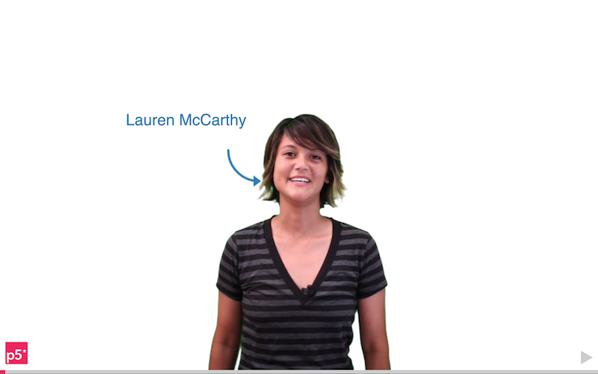

  The aim of this tutorial is to get you familiar with the p5js library.
  You will also write your first programming 'sketch' with p5js.

## P5js helps you do creative coding in JavaScript

P5js is a JavaScript library for creative coding.

<!-- Idea for a 'what is' introductory interactive -->

## Watch the hello p5js video

This short [interactive video](http://hello.p5js.org/) gives an introduction
to the p5 project from Lauren McCarthy and Daniel Shiffman. Notice how the
graphics in the video are interactive? That's all done with the p5 library.
Make sure you click around and explore how it works!

<!-- TODO: I'd like to embed the hello p5js video but it requires an extra click.

<iframe src="http://hello.p5js.org/" height="315" width="560" 
  allowfullscreen="" frameborder="0">

-->

## Sign up for an account on the p5js web editor

* <https://editor.p5js.org/>

## Your first p5js sketch: the world's simplest drawing program

* Draw an ellipse
* Change the colour
* Make the ellipse follow the mouse
* Show mouse coordinates when the user presses the mouse

## Download an editor so you can code locally

* Visual Studio Code
* Atom
* SublimeText

## Check out these other resources for learning to code

* [resources]({{site.baseurl}}/resources)
* [books](https://p5js.org/books/)