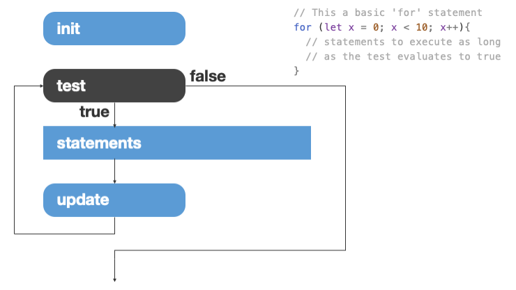
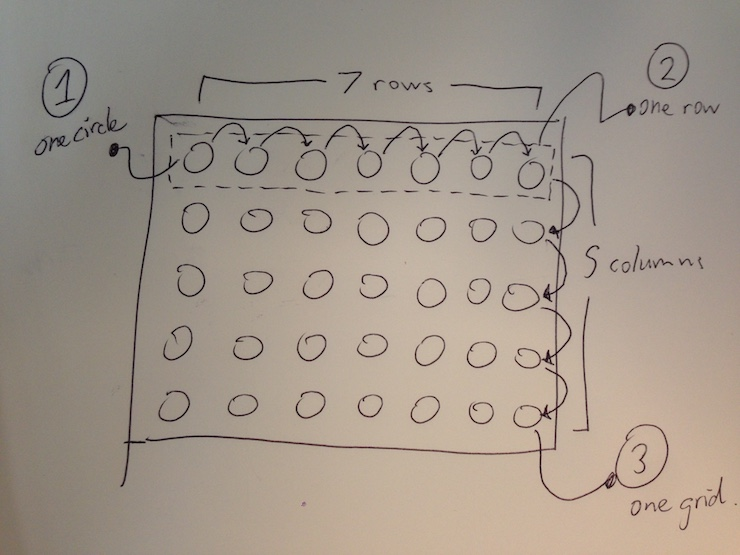
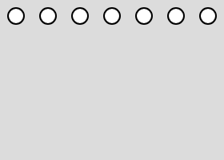
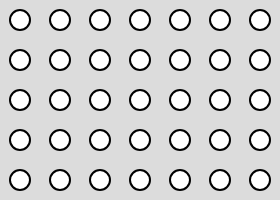
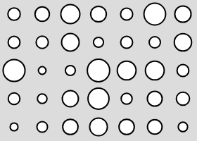
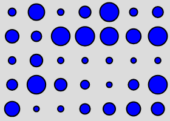

  In this week's tutorial we'll look at using p5js to create Patterns
  exploring foundational programming concept of iteration (looping and repeating).
  We'll add mouse and time as inputs to the sketch to vary the results. We'll
  also look at random and noise functions. The outcomes of the in class activity
  will form of the assignment 1 submission. The outcome should be a sketch
  which makes a visual pattern using a for loop, and where keyboard input varies
  the pattern.  

## Creating loops with 'for'

In JavaScript, you can use a `for` statement to produce repeating loops. The
general form of a for loop is shown in the following diagram taken from last
week's lecture.

In code, the for statement looks like this:


// The for loop in this code draws a series of vertical lines
function setup(){
  createCanvas(200, 200);
  background(220);

  for(let i = 20; i < 150; i += 10){
    line(i, 20, i, 180);
  }
}


The for loop in the code listing above is contained on the lines of code from
line 6 to 8. The parts of the statement in this case are:

* **init:** `let i = 20;` – here, we create a temporary variable i, which only 
  lasts as long as the loop and is then forgotten. The initial value of i is set
  to 20.
* **test:** `i < 150;` – the test is evaluated each time before another loop
  starts. Here, the loop will keep going as long as the value stored in i is
  less than 150. As long as the test is true, the statements will be executed.
  As soon as the statement is false, the program will jump to the next line of
  code after the for loop.
* **statements:** `line(i, 20, i, 180);` – the statements are contained between
  the curly brackets `{`, `}`. You can have as many lines of code here as you
  like, but there is only one in this simple example. These get executed each
  time the loop runs. Notice that the value of i gets used in the call to the
  `line()` function. This is what makes the position of the line change each
  time.
* **update:** `i += 10` – the update statement is what *changes* the value of
  the loop variable each time. It is executed each time *after* the statements
  are done. Here, the value stored in the variable i gets 10 added to it each
  time.

  

    <strong>Task:</strong> Test your understanding and alter the code above so
    that:
  

  <ol>
    <li>
      The lines go all the way across the canvas (hint: change test)
    </li>
    <li>
      The lines are spaced closer together (hint: change update)
    </li>
    <li>
      The lines only cover the right half of the canvas (hint: init, test)
    </li>
    <li>
      The lines are horizontal rather than vertical and go down the canvas (hint: statements)
    </li>
  </ol>

  <strong>Note:</strong> The code listing above does not include a draw loop.
  All of the drawing code is included in the setup function, so it only gets run
  once at startup. You can use this pattern if you just want to draw a static
  image without interactivity or changes over time.

## Loops inside loops (inside loops?)

A for statement can have as many lines of code as you like in the block of
statements that get executed each time through. You can even include a second
for loop inside the first one. Why would you do this? – one common reason is if
you want to draw any kind of grid pattern the canvas. Let's see how this is
done.

First, let's think about what we are trying to draw and how you would break that
down into steps that the  computer can understand. Let's say we want to draw a
grid of circles, like the following sketch.

The way to think about how to translate this into a for loop is to break it
down into its parts. 

* The simplest part of this diagram is a single circle. We already know how to
  use the `circle()` function to draw that.
* The next simplest part of the diagram is a single row of circles. We already
  know how to draw that with a single `for` loop draws *across* the canvas.
* The last part of the diagram is a series of rows that together make up a grid.
  For this, we need a second `for` loop that draws *down* the canvas.

Let's start by making a single loop that draws a single row of circles.


// The for loop in this code draws a series of vertical lines
function setup(){
  createCanvas(140, 100);
  background(220);

  for(let x = 10; x < 140; x += 20){
    circle(x, 10, 5);
  }
}


The image should look something like the following:

Now think about what if we could take that single row and instead of always
having it drawn at the same y position, we could use a second variable to change
the y-position each time. That is where the second loop comes in. We just put 
the whole of our first loop *inside* another one, as follows.


// The for loop in this code draws a series of vertical lines
function setup(){
  createCanvas(140, 100);
  background(220);

  for(let y = 10; y < 100; y += 20){
    for(let x = 10; x < 140; x += 20){
      circle(x, y, 5);
    }
  }
}


The output should look like the following image:

## Adding random variation

So far, the grid we've drawn are rather... boring. Adding some random is one way
to make a pattern more visually interesting. To do this, we will use the
`random()` function.

The `random()` function can take one or two arguments. If you give it a single
argument, it will return a random number somewhere between zero, and the number
you gave. For example, the following code will print out a series of random
numbers.


// Prints out a series of random numbers to the console
function draw(){
  // Print a random number between 0..10 each time.
  console.log(random(10));
}


  <strong>Tip:</strong> Make sure you have the console open in the p5js web
  editor to see the output.

If you give random two arguments, it will give you a random number *between*
them. E.g. the following code will print out a random number between 9 and 10.


// Prints out a series of random numbers to the console
function draw(){
  // Print a random number between 9..10 each time.
  console.log(random(9, 10));
}


Let's use this to make the grid a *little* bit more interesting by setting a
random radius for the circles each time through the loop.


// The for loop in this code draws a series of vertical lines
function setup(){
  createCanvas(140, 100);
  background(220);

  for(let y = 10; y < 100; y += 20){
    for(let x = 10; x < 140; x += 20){
      let r = random(2, 8);
      circle(x, y, r);
    }
  }
}


## Responding to the keyboard

Another thing we could do is respond to the keyboard. To do this, we will add
a keyboard event. In this example, we will change the colour of the dots
depending on which key is pressed.


let circleColor;

function setup(){
  createCanvas(140, 100);
  circleColor = color(255, 0, 0);
}

function draw(){
  background(220);
  fill(circleColor);

  for(let y = 10; y < 100; y += 20){
    for(let x = 10; x < 140; x += 20){
      let r = random(2, 8);
      circle(x, y, r);
    }
  }

  // Stops the draw function being called until 'loop()' is called below.
  noLoop();
}

function keyPressed(){
  if (key == 'r'){
    circleColor = color(255, 0, 0);
  } else if (key == 'g'){
    circleColor = color(0, 255, 0);
  } else if (key == 'b'){
    circleColor = color(0, 0, 255);
  }
  loop();
}


The output should look like the following:

## Support: processing tutorials and examples

To continue, you should review the following examples for further examples of
how to work with looping. Think about how you can use randomness, colour and
simple input from the keyboard or mouse to produce an interesting visual result:

### Examples

* [Iteration example](https://p5js.org/examples/structure-width-and-height.html):
  makes a nice weave effect
* [Embedded Iteration](https://p5js.org/examples/control-embedded-iteration.html)
* [Conditionals 1](https://p5js.org/examples/control-conditionals-1.html)
* [Conditionals 2](https://p5js.org/examples/control-conditionals-2.html)
* [Logical Operators](https://p5js.org/examples/control-logical-operators.html)
* [Random Function](https://p5js.org/examples/math-random.html)

<!-- * [Advanced grid with 3D objects](http://processing.org/examples/mixturegrid.html) -->

<!--
### Advanced examples From generative design text

* <http://www.generative-gestaltung.de/1/P_2_3_6_01>
* <http://www.generative-gestaltung.de/1/P_2_3_6_02>
-->

<!--
### Processing tutorials

* [Anatomy of a Program](http://processing.org/tutorials/anatomy/)
* [2D Transformations](http://processing.org/tutorials/transform2d/)
* [Trigonometry Primer](http://processing.org/tutorials/trig/)

-->