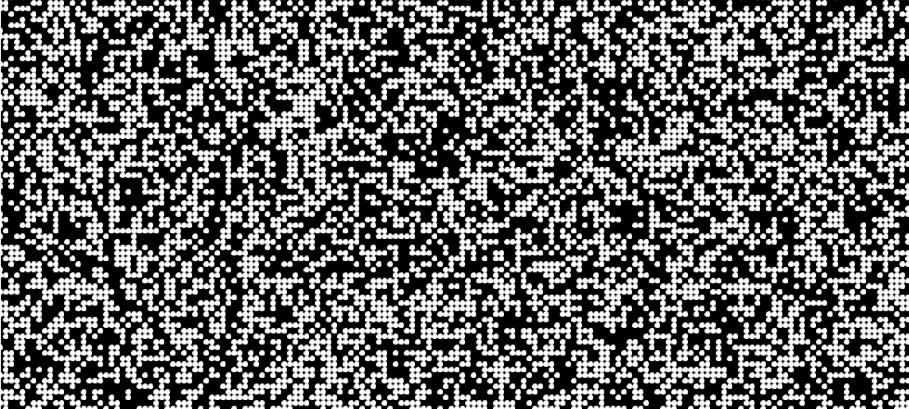

## TODO:

* [ ] Update examples and links from processing to p5.js
* [ ] Port [mixture grid](https://processing.org/examples/mixturegrid.html)
      example from Processing to p5.js
* [ ] Add a guided section on keyboard input
* [ ] Add a guided section on iteration
* [ ] Port examples from Generative Design text
* [ ] Port trigonometry, anatomy of a program, and 2D coordinates tutorials.
* [ ] Look at adding the 'nuts and bolts' that was in wk02 lecture into the tutorial notes.

## Tutorial activity

- A sketch draws a pattern using for loops
- use random() function to vary pattern
- use mouse input to vary pattern 
- dist() function to vary pattern
- use key input to vary the pattern

